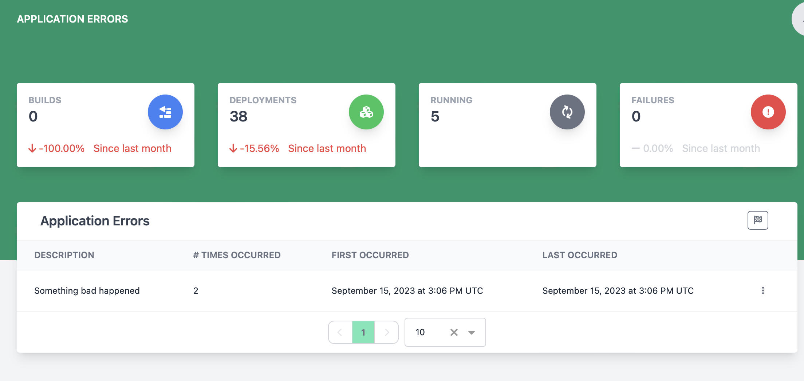

# Viewing and Managing Application Errors

The application errors page lets a champagne admin user view and resolve a list of application errors that have occurred in champagne.

## Resolve a single error

To resolve a single error, find the row with the error to resolve and click the 3 vertical dots to open the action menu and select Resolve.

## Resolve all unresolved errors

To resolve all existing errors that are unresolved, click the button at the top right of the Application Errors card.

## Viewing error details

To view more details about a specific error, then find the row with the error and click the 3 vertical dots to open the action menu and select View Details. This will open a dialog with more information including error causes and stack traces.
