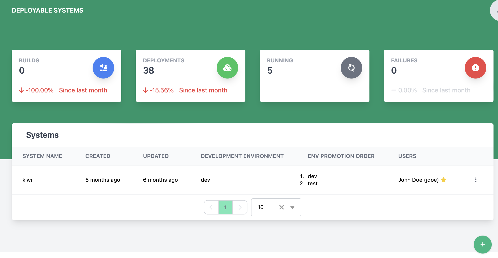

# Viewing and Managing Deployable Systems

The systems page lets a champagne admin user manage a list of deployable systems in champagne.

## Creating a system

1. Click the  button at the bottom of the screen
2. The create new system dialog will appear

    

3. Enter the new system name (**This is required**)
4. Click Save to create the component

## Deleting a system

To delete a system, find the row with the system to be deleted and click the 3 vertical dots to open the action menu and select Remove. Note this will delete EVERYTHING related to that system.
