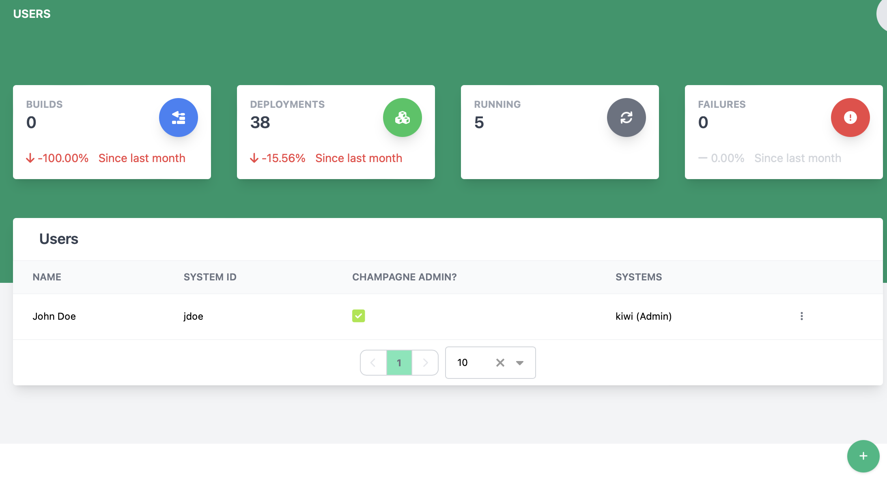

# Viewing and Managing Champagne Users

The users page lets a champagne user manage a list of users.

## Creating a user

1. Click the  button at the bottom of the screen
2. The create new user dialog will appear

    

3. Enter the user's first name (**This is required**)
4. Enter the user's last name (**This is required**)
5. Enter the user's username (**This is required**)
6. If desired, check the Admin box to make the user a Champagne admin
7. Click Save to create the user

## Remove User

To remove a user from champagne, find the user to be removed and click the 3 vertical dots to open the action menu and click Remove User.

## Edit User

To edit a user, find the user to be edited and click the 3 vertical dots to open the action menu and click Edit User.

## Add User to a System

To add a user to a system, find the user to be added and click the 3 vertical dots to open the action menu and click Add to System. In the dialog, select the system to add the user to and click Save.

