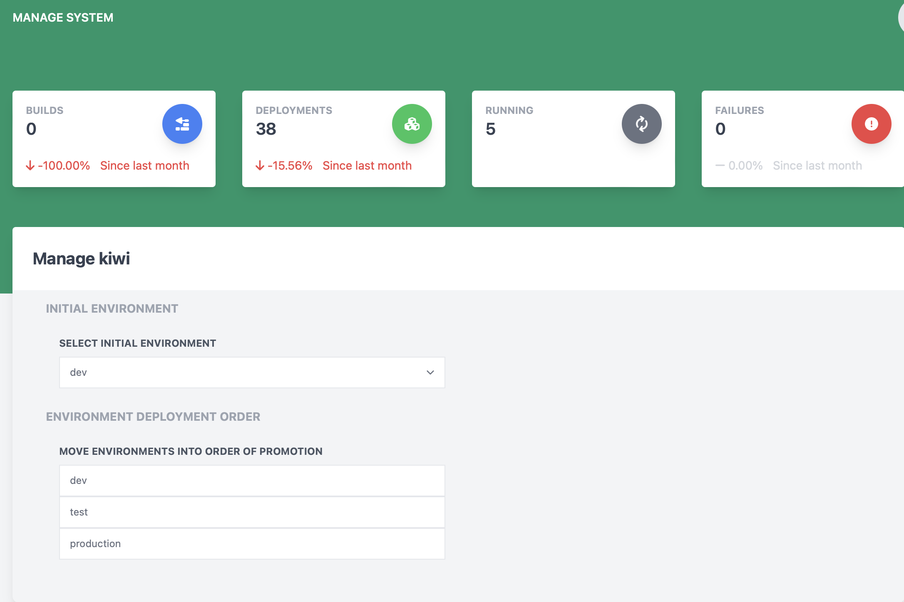

# Managing System Settings

The manage system page allows for changes to be made to various settings of the system.

**Heads Up!** This page can only be accessed by administrators of the deployable system!

## Initial Environment

This section allows for the setting of which of the deployment environments should be marked as the first environment that components will be deployed to. Any environments after this environment will have builds promoted to that environment.

## Environment Deployment Order

This section allows the ordering of deployment environments in the system so that promotions will transition through the environments correctly.
