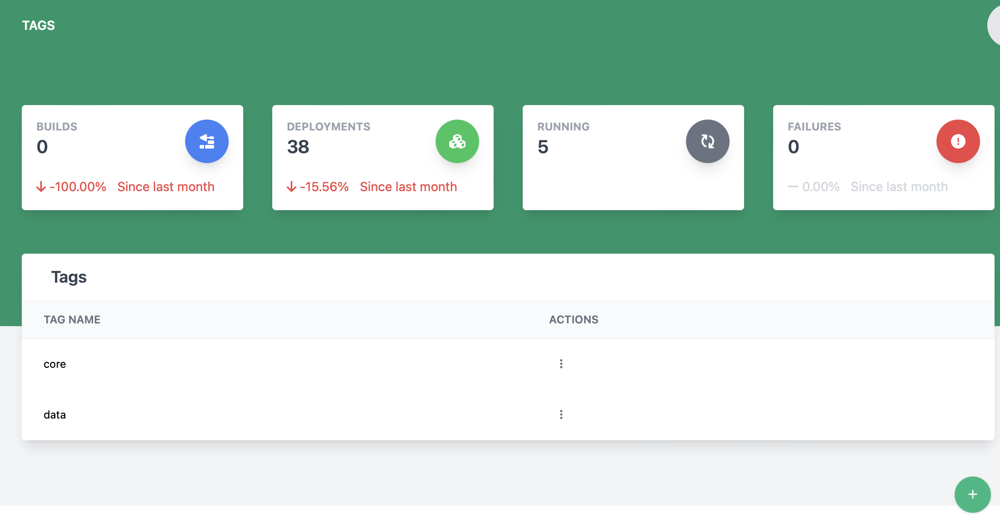

# Viewing and Managing Tags

The tags page lets a system admin user manage a list of tags for the system that will be used to link hosts and components.

## Creating a tag

1. Click the  button at the bottom of the screen
2. The create new tag dialog will appear

    

3. Enter the new tag name (**This is required**)
4. Click Save to create the tag

## Deleting a tag

To delete a tag, find the row with the tag to be deleted and click the 3 vertical dots to open the action menu and select Remove.

## Editing a tag

To edit a tag, find the row with the tag to be edited and click the 3 vertical dots to open the action menu and select Edit.
