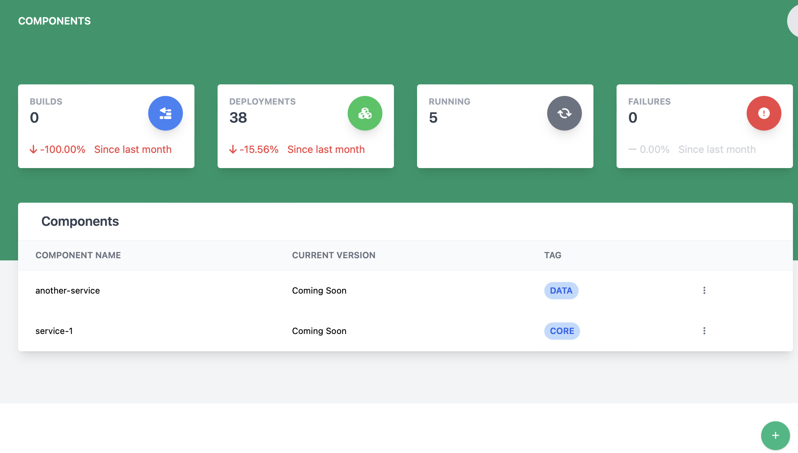

# Viewing and Managing Components

The component page lets a user manage a list of deployable components for the system.

## Creating a component

**Heads Up!** Creating can only be performed by administrators of the deployable system!

1. Click the  button at the bottom of the screen
2. The create new component dialog will appear

    

3. Enter the new component name (**This is required**)
4. Select the tag for the component (This is how components are linked to hosts). **This is required**
5. Click Save to create the component

## Deleting a component

**Heads Up!** Deleting can only be performed by administrators of the deployable system!

To delete a component, find the row with the component to be deleted and click the 3 vertical dots to open the action menu and select Remove Component

   

## Editing a component

**Heads Up!** Editing can only be performed by administrators of the deployable system!

To edit a component, find the row with the component to be edited and click the 3 vertical dots to open the action menu and select Edit Component

   
