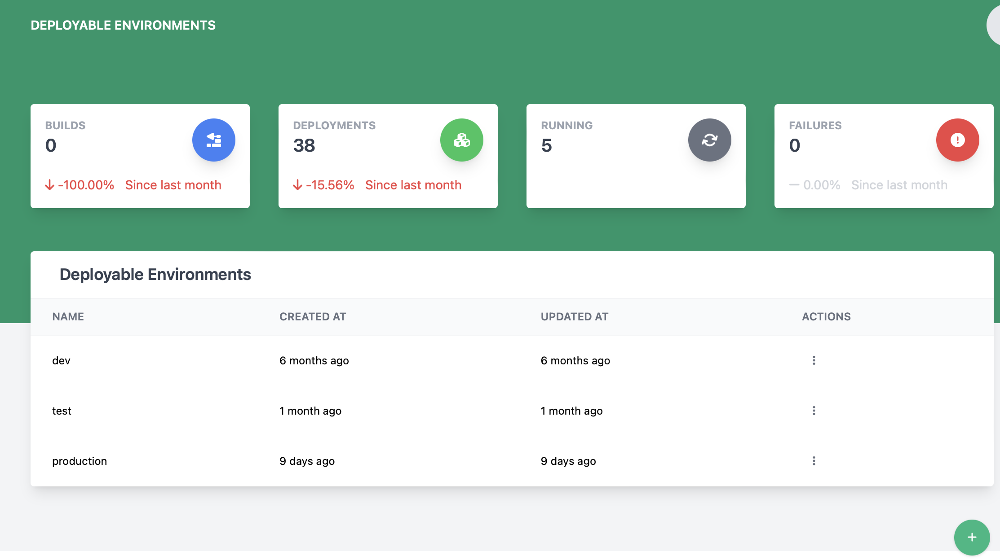

# Environments

The environments page lets a user manage a logical list of deployable environments for the overall system.

## Creating an environment

1. Click the  button at the bottom of the screen
2. The create new environment dialog will appear

    
   
3. Enter the new environment name (**This is required**)
4. Click Save to create the environment

## Enabling/Disabling an environment

Deployable environments can be enabled and disabled. This might be a better option than deleting the environment if there
is historical data related to the environment that should be kept.

**Heads Up!** Enabling and Disabling can only be performed by administrators of the deployable system!

### Disable an environment

To disable an environment, find the row with the environment to be disabled, click the 3 vertical dots and select Deactivate.

### Enable an environment

To enable an environment, find the row with the environment to be enabled, click the 3 vertical dots and select Activate.

## Deleting an environment

Deployable environments can be deleted. Beware, however, that this will also delete all information related to that 
deployable environment

**Heads Up!** Deleting can only be performed by administrators of the deployable system!

To delete an environment, find the row with the environment to be deleted and click the 3 vertical dots and select Remove.

