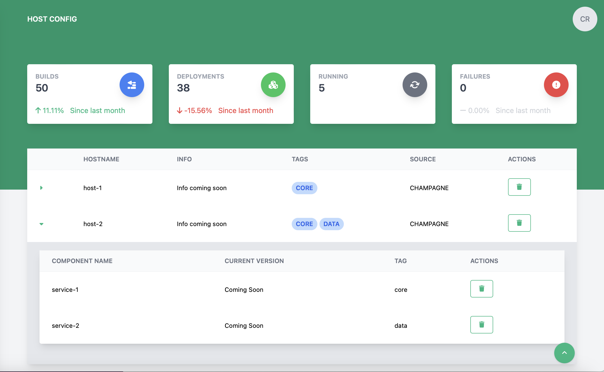

# Host Configuration

The host configuration page lets a user manage a list of deployable hosts and components for the system.

## Creating a host

**Heads Up!** Creating can only be performed by administrators of the deployable system!

1. Click the  button at the bottom of the screen
2. Click the  button 
3. The create new host dialog will appear

    

4. Enter the new host name (**This is required**)
5. Enter any tags for the host (This is how components are linked to hosts). **After entering a tag name, type enter so that the tag gets included**
6. Click Save to create the host

## Deleting a host

Hosts can be deleted. This will _only_ delete the host entry and will _not_ delete any of the components linked to that host.

**Heads Up!** Deleting can only be performed by administrators of the deployable system!

To delete a host, find the row with the host to be deleted and click the  button.

## Creating a component

**Heads Up!** Creating can only be performed by administrators of the deployable system!

1. Click the  button at the bottom of the screen
2. Click the  button
3. The create new host dialog will appear

    

4. Enter the new component name (**This is required**)
5. Enter the tag for the component (This is how components are linked to hosts). **This is required**
6. Click Save to create the component

## Deleting a component

Components can be deleted. This will delete the component entry and will unlink it from every host matching the tag.

**Heads Up!** Deleting can only be performed by administrators of the deployable system!

To delete a component, find the row with the component to be deleted and click the  button.
