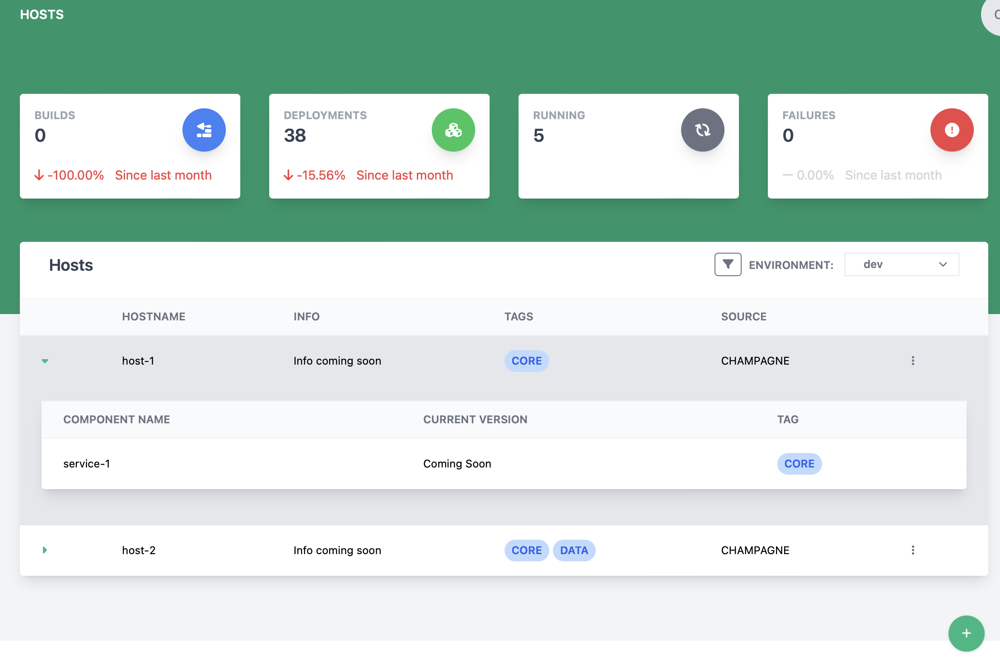

# Viewing and Managing Hosts

The host page lets a user manage a list of deployable hosts for the system.

## Creating a host

**Heads Up!** Creating can only be performed by administrators of the deployable system!

1. Click the  button at the bottom of the screen
2. The create new host dialog will appear

    

4. Enter the new host name (**This is required**)
5. Select any tags for the host (This is how components are linked to hosts).
6. Click Save to create the host

## Deleting a host

Hosts can be deleted. This will _only_ delete the host entry and will _not_ delete any of the components linked to that host.

**Heads Up!** Deleting can only be performed by administrators of the deployable system!

To delete a host, find the row with the host to be deleted and click the 3 vertical dots to open the action menu and select Remove Host

   

## Editing a host

**Heads Up!** Editing can only be performed by administrators of the deployable system!

To edit a host, find the row with the host to be edited and click the 3 vertical dots to open the action menu and select Edit Host

   
