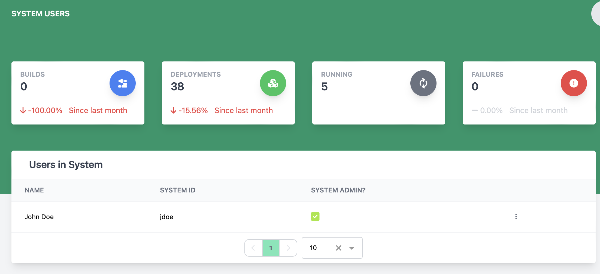

# Viewing and Managing System Users

The system users page lets a user manage a list of users in a system.

**Heads Up!** The following actions can only be performed by administrators of the deployable system!

## Remove User from System

To remove a user from a system, find the user to be removed and click the 3 vertical dots to open the action menu and click Remove User.

## Make User an Admin in the System

To make a user an admin in a system, find the row with the user to change and click the 3 vertical dots to open the action menu and click Become Admin.

## Remove Admin flag from User in the System

To remove the admin flag from a user in a system, find the row with the user to change and click the 3 vertical dots to open the action menu and click Remove Admin.
