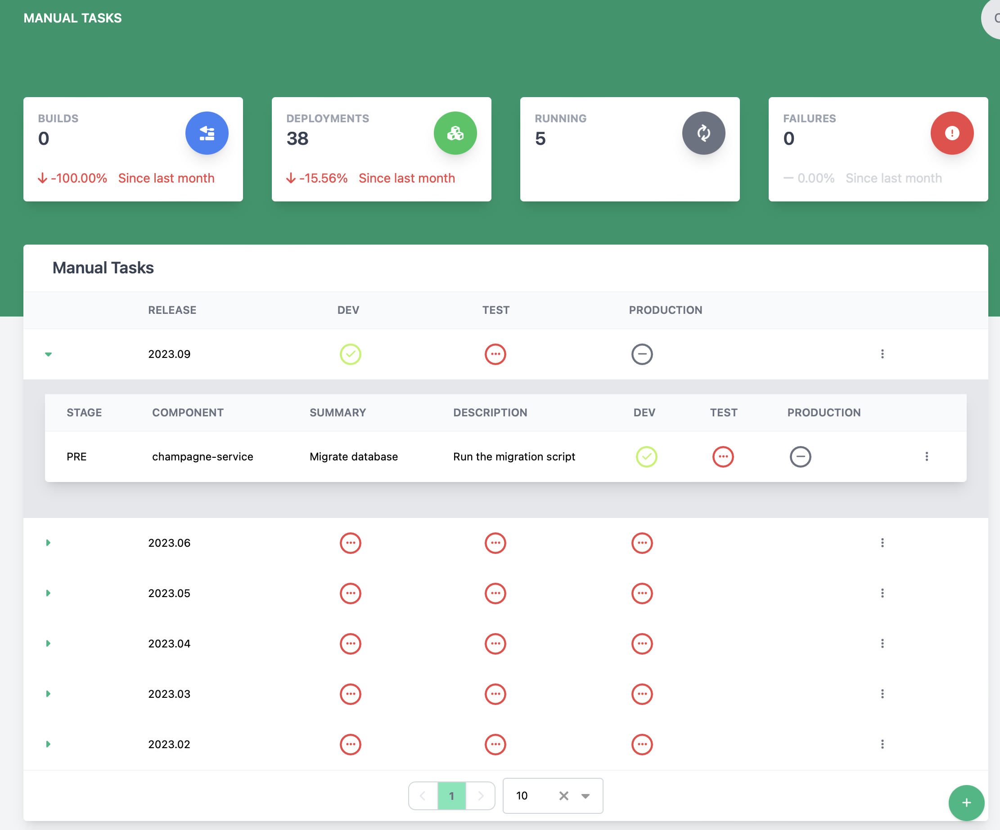

# Viewing and Managing Manual Tasks

The manual tasks page lets a user manage a list of releases and manual tasks that are needed in those releases for a system.

## Creating a release

1. Click the  button at the bottom of the screen
2. The create new release dialog will appear

    

3. Enter the new release name (**This is required**)
4. Click Save to create the release

## Deleting a release

To delete a release, find the row with the release to be deleted and click the 3 vertical dots to open the action menu and select Delete Release. Note: This will delete all tasks in that release too.

   

## Create a task

1. Find the row with the release to add a task for and click the 3 vertical dots to open the action menu and select Create Task.
2. The create new task dialog will appear

    

3. Enter the task summary (**This is required**)
4. Enter the task description
5. Enter the task component (**This is required**)
6. Select the task execution stage, either pre or post deployment (**This is required**)
7. Click Save to create the task

## Delete a task

To delete a task, find the row with the task to be deleted and click the 3 vertical dots to open the action menu and select Delete Task.

## Change task or release status for an environment

To change the status of a given task or release in a specific environment, click the icon showing the status. This will open the status change dialog. Choose the new status (Pending, Complete, Not Required) and click Save.
